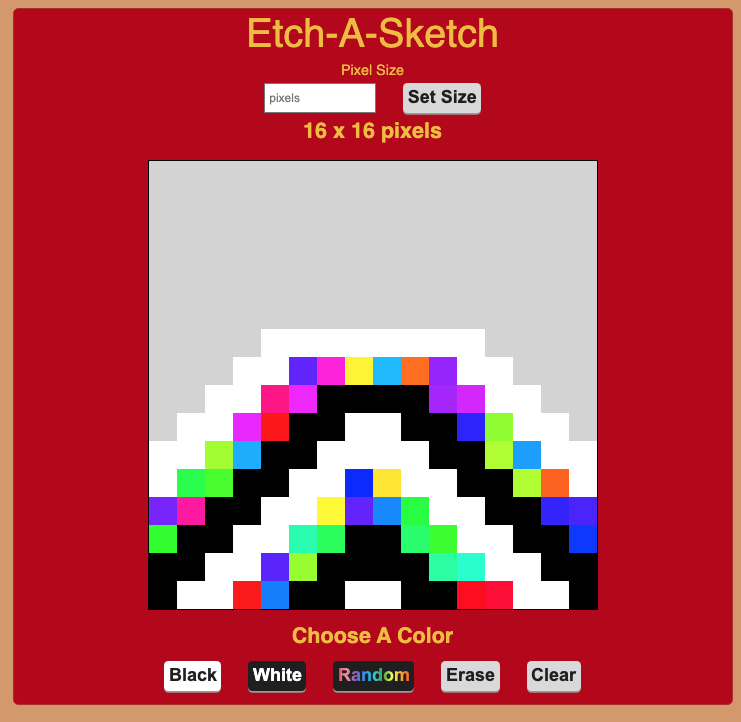

# Etch-A-Sketch
See the different designs you can on this Etch-A-Sketch built using HTML, CSS, and JavaScript

## Table of Contents
[Introduction](#Introduction)

[Motivation](#Motivation)

[Screenshot](#Screenshot)

[Built With](#built-with)

[License](#License)

[Acknowledgements](#Acknowledgements)

## Introduction
This project is part of the JavaScript Basics section from the Odin Projects(LINK) Foundations Course. This project brought together HTML, CSS, and JavaScript to build an Etch-A-Sketch that a user can create a drawing.

The Etch-A-Sketch is displayed in a 16x16 grid created using JavaScript. The event listeners listen for an onHover event to change the color of the squares.The user can choose between the colors black, white, and rainbow, as well as the option to erase. The user can also change the number of squares within the grid without changing the size of the grid.

## Motivation
I completed this project as part of the Odin Project Foundations Course. I started that course to practice my JavaScript skills. This project gave me the opportunity to practice those skills and combine them with HTML and CSS to create a web application that changes based on user input.

## Screenshot

## Built With
- HTML
- CSS
- JavaScript

## License
[MIT](https://choosealicense.com/licenses/mit/)

## Acknowledgements
[The Odin Project](https://www.theodinproject.com/) for putting together the curriculum for the [Foundations Course](https://www.theodinproject.com/paths/foundations/courses/foundations)
